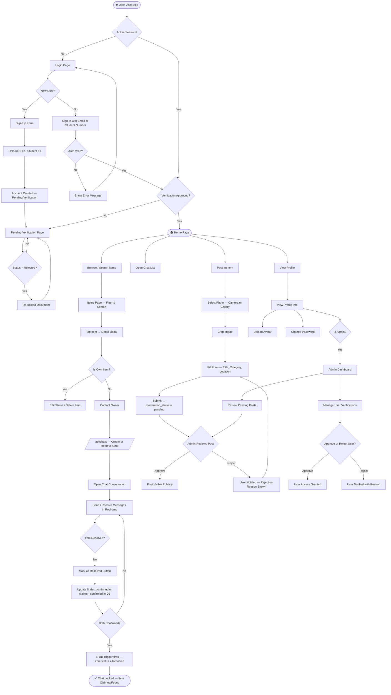
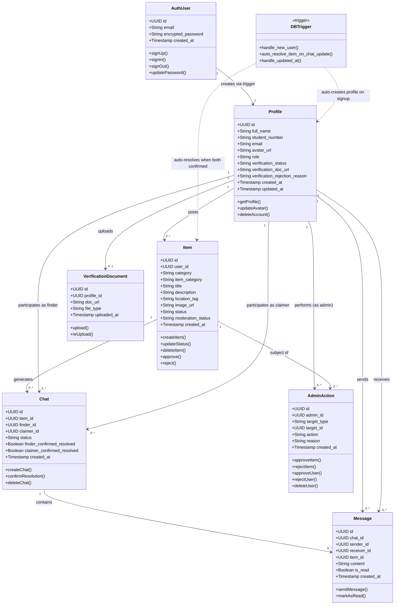

# FoundIt — Flowchart & UML Class Diagram

> This file contains the Mermaid source code for the system flowchart and UML Class Diagram.
> Paste these into [Mermaid Live Editor](https://mermaid.live) to render them, or use any tool that supports Mermaid (Notion, VS Code with Mermaid extension, etc.).

---

## PART 1 — SYSTEM FLOWCHART

### Why these nodes are included:

| Node / Decision | Reason for Inclusion |
|---|---|
| **Visit App** | Every system starts with the entry point — the user accessing the URL |
| **Active Session?** | Supabase Auth uses JWT sessions; this check prevents unauthenticated access to all protected routes (enforced by `useAuthGuard`) |
| **Verification Approved?** | The identity gate — only verified LSPU students access the main app. Unverified users see the Pending Verification page |
| **Registration + Doc Upload** | New user flow — captures name, student number, email, password, and COR/Student ID for admin review |
| **Home Page / Navigation** | Hub of the application — from here users branch into all major features |
| **Browse / Search Items** | Core read operation — the most common user action |
| **Post Item** | Core write operation — the user reports a found or lost item |
| **Moderation Queue** | Admin must approve before the post is visible — critical content control decision point |
| **Admin Approve/Reject** | The admin's two possible moderation outcomes |
| **Contact Owner** | Triggers the chat creation flow — key interaction between finder and claimer |
| **Chat Created** | One-per-pair deduplication enforced by the API route |
| **Mark as Resolved** | Both-sides confirmation — the final state transition requiring a DB trigger |
| **Both Confirmed?** | Database trigger `trg_auto_resolve_item` checks both flags — only resolves when BOTH are true |
| **Item Resolved** | Terminal state — item is marked Claimed/Found, chat is locked |

---

## PART 2 — UML CLASS DIAGRAM

### Why these classes and relationships are included:

| Class | Why Included |
|---|---|
| **User (AuthUser)** | Represents the Supabase `auth.users` record — the root authentication identity. Every other entity traces back to this |
| **Profile** | Extends the auth user with LSPU-specific data (student number, verification status, role). Has a 1-to-1 relationship with User |
| **Item** | The primary content entity. Belongs to a poster (Profile), has a category (Lost/Found), moderation status, and resolution status |
| **Chat** | The connection entity between a finder (poster) and a claimer (interested party) for a specific item. Has dual-confirmation fields for resolution |
| **Message** | The content within a Chat. Belongs to both a sender and receiver Profile, and links to the item context |
| **AdminAction** | Represents the admin's moderation decision on an Item or Profile — captures who acted, when, and what reason was given |
| **VerificationDocument** | Represents the COR/Student ID uploaded during signup — links to the Profile and tracks upload URL and review status |

**Key Relationships explained:**
- **Profile → Item (1-to-many)**: One student can post many items
- **Item → Chat (1-to-many)**: One item can generate multiple chats (from multiple interested parties)
- **Chat → Message (1-to-many)**: One conversation has many messages
- **Profile → Message (1-to-many, sender + receiver)**: A profile sends and receives messages
- **Profile → VerificationDocument (1-to-1)**: Each student has one verification document per registration
- **AdminAction → Item / Profile**: Admins act on items (approve/reject) and profiles (approve/reject user)

---

## HOW TO USE THESE DIAGRAMS

### Option 1 — Mermaid Live (Free, No Account Needed)
1. Go to **https://mermaid.live**
2. Paste the code block (without the triple backticks) into the editor
3. The diagram renders on the right
4. Click **Export → PNG** or **SVG** to download

### Option 2 — draw.io (Free)
1. Go to **https://app.diagrams.net**
2. Use the flowchart shapes to manually recreate the diagram (use the Mermaid diagram as your blueprint)
3. Export as PNG/PDF for submission

### Option 3 — VS Code
1. Install the **"Mermaid Preview"** extension (free)
2. Open this file — diagrams render inline in the preview panel

---

*For the final submission, export the diagrams as PNG images and insert them into Section III (Flowchart) of the project report.*
